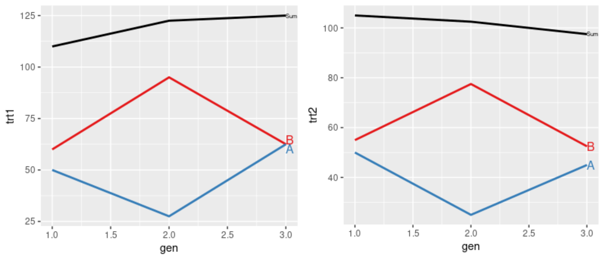

<!-- README.md is generated from README.Rmd. Please edit that file -->

```{r, echo = FALSE}
# show me all columns
options(
  tibble.width = Inf,
  pillar.bold = TRUE,
  pillar.neg = TRUE,
  pillar.subtle_num = TRUE,
  pillar.min_chars = Inf
)

knitr::opts_chunk$set(
  collapse = TRUE,
  dpi = 300, # change to 300 once on CRAN
  warning = FALSE,
  message = FALSE,
  out.width = "100%",
  comment = "#>",
  fig.path = "man/figures/README-"
)
```

# AlphaPart

| Package | Status | Coverage | GitHub | Miscellaneous |
|-----------------|----------------- | ----------------- | ----------------- | ----------------- |
[](https://cran.r-project.org/package=AlphaPart) | [](https://img.shields.io/badge/development-active-blue.svg) | [](https://codecov.io/gh/AlphaGenes/AlphaPart) | [](https://github.com/AlphaGenes/AlphaPart/) | [](https://cranlogs.r-pkg.org/badges/AlphaPart)  <!-- line break 1 -->
[](https://cran.r-project.org/web/checks/check_results_AlphaPart.html) | [](https://travis-ci.com/github/AlphaGenes/AlphaPart/)  | [](https://github.com/AlphaGenes/AlphaPart/)  |  [$forks[[1]]`-blue.svg)](https://github.com/AlphaGenes/AlphaPart/) | [](https://cranlogs.r-pkg.org/badges/grand-total/AlphaPart) <!-- line break 2 -->
[](https://cran.r-project.org/) | [](https://ci.appveyor.com/project/Prof-ThiagoOliveira/alphapart) | **Code Factor** | [$open_issues[[1]]`-red.svg)](https://github.com/AlphaGenes/AlphaPart/issues) | [](https://www.gnu.org/licenses/gpl-3.0.en.html) <!-- line break 3 -->
[](https://lifecycle.r-lib.org/articles/stages.html) | [](https://github.com/AlphaGenes/AlphaPart/) | [](https://www.codefactor.io/repository/github/alphagenes/alphapart) | [](https://github.com/AlphaGenes/AlphaPart/) <!-- line break 4 -->


# Overview

A software that implements a method for **partitioning genetic trends** to quantify the sources of genetic gain in breeding programmes. The partitioning method is described in [Garcia-Cortes et al. (2008)](https://doi.org/10.1017/S175173110800205X). The package includes the main function `AlphaPart` for partitioning breeding values and auxiliary functions for manipulating data and summarizing, visualizing, and saving outputs.


# Instalation

```r
# The easiest way to get AlphaPart
install.packages("AlphaPart")
```

## Development version

To get a bug fix or to use a feature from the development version, you can install the development version of `AlphaPart` from GitHub.

```r
install.packages("devtools")
devtools::install_github("AlphaGenes/AlphaPart")
```

# Contributing to AlphaPart


Please, follow the contribution guide at [Contributing file](CONTRIBUTING.md) to know how to start contributing to `AlphaPart`.

# Usage

```r
library(AlphaPart)

## Partition additive genetic values by country and sex
AlphaPart.ped$country.gender <- with(AlphaPart.ped, paste(country, gender, sep="-"))
(res <- AlphaPart(x=AlphaPart.ped, colPath="country.gender", colBV=c("bv1", "bv2")))
#> Size:
#>  - individuals: 8 
#>  - traits: 2 (bv1, bv2)
#>  - paths: 4 (domestic-F, domestic-M, import-F, import-M)
#>  - unknown (missing) values:
#> bv1 bv2 
#>   0   0 


#>  Partitions of breeding values 
#>    - individuals: 8 
#>    - paths: 4 (domestic-F, domestic-M, import-F, import-M)
#>    - traits: 2 (bv1, bv2)

#>  Trait: bv1 

#>   IId FId MId gen  country gender country.gender bv1 bv1_pa bv1_w bv1_domestic-F bv1_domestic-M bv1_import-F bv1_import-M
#> 1   A           1 domestic      F     domestic-F 100    0.0 100.0        100.000            0.0          0.0        0.000
#> 2   B           1   import      M       import-M 105    0.0 105.0          0.000            0.0          0.0      105.000
#> 3   C   B   A   2 domestic      F     domestic-F 104  102.5   1.5         51.500            0.0          0.0       52.500
#> 4   T   B       2   import      F       import-F 102   52.5  49.5          0.000            0.0         49.5       52.500
#> 5   D           2   import      M       import-M 108    0.0 108.0          0.000            0.0          0.0      108.000
#> 6   E   D   C   3 domestic      M     domestic-M 107  106.0   1.0         25.750            1.0          0.0       80.250
#> 7   U   D       3   import      F       import-F 107   54.0  53.0          0.000            0.0         53.0       54.000
#> 8   V   E       4 domestic      F     domestic-F 109   53.5  55.5         68.375            0.5          0.0       40.125

#>  Trait: bv2 

#>   IId FId MId gen  country gender country.gender bv2 bv2_pa bv2_w bv2_domestic-F bv2_domestic-M bv2_import-F bv2_import-M
#> 1   A           1 domestic      F     domestic-F  88    0.0  88.0          88.00           0.00          0.0          0.0
#> 2   B           1   import      M       import-M 110    0.0 110.0           0.00           0.00          0.0        110.0
#> 3   C   B   A   2 domestic      F     domestic-F 100   99.0   1.0          45.00           0.00          0.0         55.0
#> 4   T   B       2   import      F       import-F  97   55.0  42.0           0.00           0.00         42.0         55.0
#> 5   D           2   import      M       import-M 101    0.0 101.0           0.00           0.00          0.0        101.0
#> 6   E   D   C   3 domestic      M     domestic-M  80  100.5 -20.5          22.50         -20.50          0.0         78.0
#> 7   U   D       3   import      F       import-F 102   50.5  51.5           0.00           0.00         51.5         50.5
#> 8   V   E       4 domestic      F     domestic-F 105   40.0  65.0          76.25         -10.25          0.0         39.0


## Summarize population by generation (=trend)
(ret <- summary(res, by="gen"))

#> Summary of partitions of breeding values 
#>   - paths: 4 (domestic-F, domestic-M, import-F, import-M)
#>   - traits: 2 (bv1, bv2)

#> Trait: bv1 

#>   gen N      Sum domestic-F domestic-M import-F import-M
#> 1   1 2 102.5000   50.00000        0.0      0.0   52.500
#> 2   2 3 104.6667   17.16667        0.0     16.5   71.000
#> 3   3 2 107.0000   12.87500        0.5     26.5   67.125
#> 4   4 1 109.0000   68.37500        0.5      0.0   40.125

#> Trait: bv2 

#>   gen N       Sum domestic-F domestic-M import-F import-M
#> 1   1 2  99.00000      44.00       0.00     0.00 55.00000
#> 2   2 3  99.33333      15.00       0.00    14.00 70.33333
#> 3   3 2  91.00000      11.25     -10.25    25.75 64.25000
#> 4   4 1 105.00000      76.25     -10.25     0.00 39.00000

## Plot the partitions
p <- plot(ret, ylab=c("BV for trait 1", "BV for trait 2"), xlab="Generation")
print(p)
```
<!-- -->


