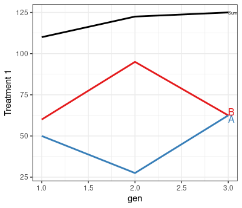

<!-- README.md is generated from README.Rmd. Please edit that file -->

# AlphaPart

| Package                                                                                                                                | Status                                                                                                                                                           | Coverage                                                                                                                                                   | GitHub                                                                                                                                                                     | Miscellaneous                                                                                                                                                |
|----------------------------------------------------------------------------------------------------------------------------------------|------------------------------------------------------------------------------------------------------------------------------------------------------------------|------------------------------------------------------------------------------------------------------------------------------------------------------------|----------------------------------------------------------------------------------------------------------------------------------------------------------------------------|--------------------------------------------------------------------------------------------------------------------------------------------------------------|
| [](https://cran.r-project.org/package=AlphaPart)                  | [](https://img.shields.io/badge/development-active-blue.svg)                             | [](https://codecov.io/gh/AlphaGenes/AlphaPart) | [](https://github.com/AlphaGenes/AlphaPart/)                                 | [](https://cranlogs.r-pkg.org/badges/AlphaPart) <!-- line break 1 -->                               |
| [](https://cran.r-project.org/web/checks/check_results_AlphaPart.html) | [](https://travis-ci.com/github/AlphaGenes/AlphaPart/builds/222967145)                | [](https://github.com/AlphaGenes/AlphaPart/)                                    | [](https://github.com/AlphaGenes/AlphaPart/)                                                                       | [](https://cranlogs.r-pkg.org/badges/grand-total/AlphaPart) <!-- line break 2 --> |
| [](https://cran.r-project.org/)                             | [](https://ci.appveyor.com/project/Prof-ThiagoOliveira/alphapart) | **Code Factor**                                                                                                                                            | [](https://github.com/AlphaGenes/AlphaPart/issues)                                                         | [](https://www.gnu.org/licenses/gpl-3.0.en.html) <!-- line break 3 -->                       |
| [](https://lifecycle.r-lib.org/articles/stages.html)             | [](https://github.com/AlphaGenes/AlphaPart/)                           | [](https://www.codefactor.io/repository/github/alphagenes/alphapart)  | [](https://github.com/AlphaGenes/AlphaPart/) <!-- line break 4 --> |                                                                                                                                                              |

# Overview

A software that implements a method for **partitioning genetic trends**
to quantify the sources of genetic gain in breeding programmes. The
partitioning method is described in [Garcia-Cortes et
al. (2008)](https://doi.org/10.1017/S175173110800205X). The package
includes the main function `AlphaPart` for partitioning breeding values
and auxiliary functions for manipulating data and summarizing,
visualizing, and saving outputs.

# Instalation

``` r
# The easiest way to get AlphaPart
install.packages("AlphaPart")
```

## Development version

To get a bug fix or to use a feature from the development version, you
can install the development version of `AlphaPart` from GitHub.

``` r
install.packages("devtools")
devtools::install_github("AlphaGenes/AlphaPart")
```

# Contributing to AlphaPart

Please, follow the contribution guide at [Contributing
file](CONTRIBUTING.md) to know how to start contributing to `AlphaPart`.

# Usage

``` r
library(AlphaPart)
## Small pedigree with additive genetic (=breeding) values
ped <- data.frame(  id=c(  1,   2,   3,   4,   5,   6),
                   fid=c(  0,   0,   2,   0,   4,   0),
                   mid=c(  0,   0,   1,   0,   3,   3),
                   loc=c("A", "B", "A", "B", "A", "A"),
                   gen=c(  1,   1,   2,   2,   3,   3),
                  trt1=c(100, 120, 115, 130, 125, 125),
                  trt2=c(100, 110, 105, 100,  85, 110))
## Partition additive genetic values
tmp <- AlphaPart(x=ped, colBV=c("trt1", "trt2"))
print(tmp)

#>  Partitions of breeding values 
#>    - individuals: 6 
#>    - paths: 2 (A, B)
#>    - traits: 2 (trt1, trt2)

#>  Trait: trt1 

#>   id fid mid loc gen trt1  trt1_pa     trt1_w trt1_A trt1_B
#> 1  1   0   0   A   1  100 116.6667 -16.666667    100      0
#> 2  2   0   0   B   1  120 116.6667   3.333333      0    120
#> 3  3   2   1   A   2  115 110.0000   5.000000     55     60
#> 4  4   0   0   B   2  130 116.6667  13.333333      0    130
#> 5  5   4   3   A   3  125 122.5000   2.500000     30     95
#> 6  6   0   3   A   3  125  57.5000  67.500000     95     30

#>  Trait: trt2 

#>   id fid mid loc gen trt2  trt2_pa     trt2_w trt2_A trt2_B
#> 1  1   0   0   A   1  100 103.3333  -3.333333  100.0    0.0
#> 2  2   0   0   B   1  110 103.3333   6.666667    0.0  110.0
#> 3  3   2   1   A   2  105 105.0000   0.000000   50.0   55.0
#> 4  4   0   0   B   2  100 103.3333  -3.333333    0.0  100.0
#> 5  5   4   3   A   3   85 102.5000 -17.500000    7.5   77.5
#> 6  6   0   3   A   3  110  52.5000  57.500000   82.5   27.5


## Summarize by generation
(tmp_s <- summary(tmp, by="gen"))

#>  Summary of partitions of breeding values 
#>    - paths: 2 (A, B)
#>    - traits: 2 (trt1, trt2)

#>  Trait: trt1 

#>   gen N   Sum    A    B
#> 1   1 2 110.0 50.0 60.0
#> 2   2 2 122.5 27.5 95.0
#> 3   3 2 125.0 62.5 62.5

#>  Trait: trt2 

#>   gen N   Sum  A    B
#> 1   1 2 105.0 50 55.0
#> 2   2 2 102.5 25 77.5
#> 3   3 2  97.5 45 52.5

# Plot summary output
(tmp_p <- plot(tmp_s))
```

<!-- -->

``` r
# Changing plot layout
tmp_p$trt1 +
 ylab("Treatment 1") +
 theme_bw() 
```

<!-- -->
